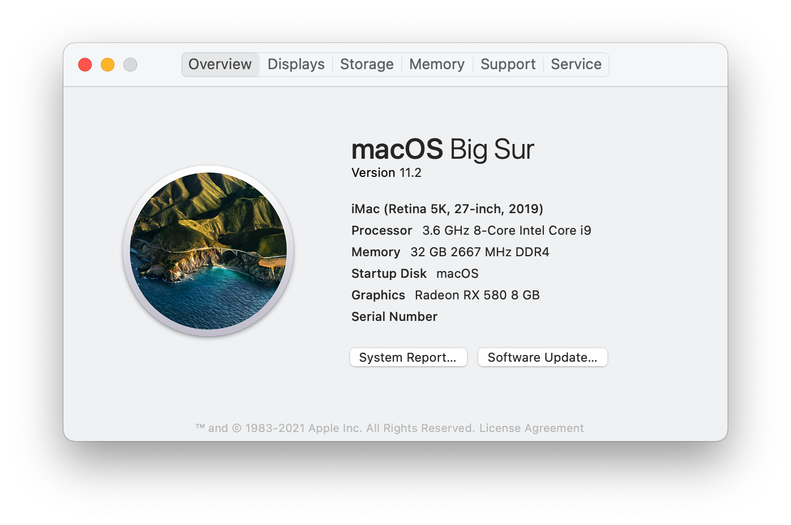

# ASRock Z390M-ITX/ac Hackintosh

Verified working with macOS version 11.2.1(20D74) Big Sur and OpenCore 0.6.6.

After you fully installation, remember to use Opencore Configurator to change your Platform Info, and choose iMac 19,1.

## Configuration

- Motherboard: ASRock Z390M-ITX/ac

- CPU: Intel® Core™ i7-8700 Processor

- iGPU: Intel® Core™ UHD Graphics 630

- dGPU: Dell AMD Radeon RX580 8G 2304SP

- WiFi/Bluetooth: BCM94360CS2

## Bios Setting

- Primary Graphics Adapter -> PCI Express

- CFG Lock -> Disable

- IGPU Multi-Monitor -> Enabled (To enable iGPU hardware boost)

- XHCI Hand-off -> Enabled

- Secure Boot -> Disabled

- CSM -> Disabled

- Above 4G Decoding -> Disabled

## What Working Fine?

- CPU Turbo
- Sleep/Awake
- iGPU Boost
- Wi-Fi/Bluetooth & Dual Network Card
- USB Port(With USBMap.kext)
- NVRAM
- SideCar
- AirDrop
- iMessage/FaceTime(After you changing the Platform Info)
